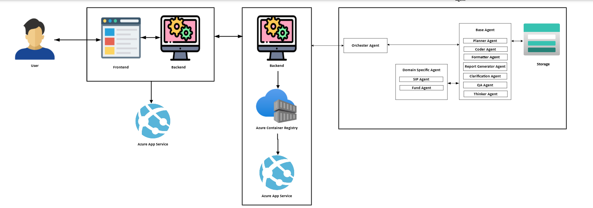

# 🌟 SIP Goal Planning & Fund Recommendation Platform

An **AI-powered financial planning system** that enables users to:  
- Plan **Systematic Investment Plans (SIP)**  
- Receive **fund recommendations**  
- View **consulting-grade reports** with projections, allocations, and strategy  

The platform combines:  
- **React UI** for user interactions  
- **FastAPI backend** for orchestration and APIs  
- **AgentLoop engine** with **Gemini LLM** for multi-agent workflows  
- **Session-aware storage** with per-user HTML reports  

---

## ✨ Features

### 🔹 FastAPI Services
- **`agent_stream_service.py`** → Streaming orchestration with **Server-Sent Events (SSE)** for real-time logs.  
- **`fastapi_sip_service.py`** → APIs for **SIP calculations** and **fund recommendations**.  

### 🔹 AgentLoop Framework
- Modular **multi-agent orchestration** (`agentLoop/flow.py`, `agentLoop/agents.py`).  
- **Graph-based execution** with debugging & validation tools.  
- **Session-aware execution** (`agentLoop/session_reader.py`).  

### 🔹 MultiMCP Servers
- Connects to **multiple MCP endpoints** (`mcp_servers/`).  
- Provides **document retrieval, captioning, and external knowledge integrations**.  
- Uses **FAISS index** for semantic fund/document search.  

### 🔹 Heuristics & Utilities
- **Heuristics engine** (`heuristics/heuristics.py`) for business rules.  
- **JSON parsing helpers** (`utils/json_parser.py`).  
- **Utility functions** (`utils/utils.py`).  

### 🔹 Streaming Reports
- **Real-time progress logs** streamed to the UI.  
- **Reports saved per session** under:  
  `media/generated/{session_id}/`  
- Two possible reports:  
  - `SIP_Goal_Planning_comprehensive_report.html`  
  - `Fund_Recommendation_comprehensive_report.html`  

### 🔹 Frontend (UI)
- Built on **React 18**.  
- **Login (Login.jsx)** → Captures user identity + IP for session tracking.  
- **SIP Form (react_sip_form.js)** → Collects details like goal type, age, horizon, risk appetite.  
- **Streaming Logs** → Live updates from agents via SSE.  
- **Reports** → Interactive HTML previews with **Previous/Next navigation**.  

---

## 🔁 End-to-End Flow

### 🟨 Login
- User logs in via **Login.jsx**.  
- Captures **user IP** + creates **session UUID**.  

### 🟨 SIP Goal Planning
- User enters SIP details (goal, age, horizon, currency, risk).  
- API dynamically fills **`SIP_Orchestrator_Prompt_Template_patched_v4.txt`** using via Jinja2 parsing.  
- **Planner** redirects to **SIPGoalPlannerAgent** to get domain specific instruction 
- Different agen are executed as per planner graph  → streamed logs to UI.  
- Generates report:  
  📑 `media/generated/{session_id}/comprehensive_report.html`  

---

### 🟨 Fund Recommendation
- After SIP completion, user clicks **“Fund Recommendation”**.  
- SIP report used to populate **`Fund_Recommendation_Orchestrator_Prompt_Template_v4.txt`**. This  is done passing sip report as context along and template to LLM .
- **FundRecommendationAgent** processes funds, applies **risk-weighted rankings**, and generates 
- Different agen are executed as per planner graph  → streamed logs to UI.  allocation.  
- Generates report:  
  📑 `media/generated/{session_id}/Fund_Recommendation_comprehensive_report.html`  

---

### 🟨 Navigation
- User navigates **back/forward** between SIP and Fund reports.  
- Reports include:  
  - Charts 📊  
  - Allocations 🪙  
  - Projections ⏳  
  - Rebalancing 🔄  
  - Tax optimization 💰  

---

## 📂 Project Structure

```plaintext
├── backend/
│   ├── agent_stream_service.py
│   ├── fastapi_sip_service.py
│
├── agentLoop/
│   ├── agents.py
│   ├── flow.py
│   ├── contextManager.py
│   ├── model_manager.py
│   └── session_reader.py
│
├── prompts/
│   ├── orchestrator_agent/
│   │   ├── SIP_Orchestrator_Prompt_Template_patched_v4.txt
│   │   └── Fund_Recommendation_Orchestrator_Prompt_Template_v1.txt
│   ├── planner_prompt_sip_patched_v12.txt
│   ├── retriever_prompt_sip_patched_v8.txt
│   ├── thinker_prompt_sip_patched_v5.txt
│   ├── qaagent_prompt_sip_patched_v4.txt
│   ├── distiller_prompt_sip_patched_v4.txt
│   ├── formatter_prompt_sip_patched_v9.txt
│   ├── coder_prompt_sip_patched_v32.txt
│   ├── executor_prompt.txt
│   ├── clarification_prompt_sip_patched_v4.txt
│   ├── scheduler_prompt_sip_patched_v4.txt
│   ├── sip_goal_planner_prompt_v4.txt
│   ├── fund_recommendation_agent_prompt_v4.txt
│   └── report_prompt_sip_patched_v16.txt
│
├── media/
│   └── generated/
│       ├── <session_uuid>/SIP_Goal_Planning_comprehensive_report.html
│       └── <session_uuid>/Fund_Recommendation_comprehensive_report.html
│
├── frontend/
│   ├── components/
│   │   ├── Login.jsx
│   │   └── react_sip_form.js
│   ├── App.js
│   ├── App.css
│   ├── index.js
│   ├── index.css
│   └── public/
│
├── requirements.txt
├── package.json
└── README.md
```

---

## 🤖 Agent → Prompt Mapping

| **Agent**                | **Prompt File**                          | **Model** | **MCP Servers** |
|---------------------------|------------------------------------------|-----------|-----------------|
| 🟨 PlannerAgent              | `planner_prompt_sip_patched_v12.txt`    | Gemini    | None            |
| 🟨 SIPGoalPlannerAgent       | `sip_goal_planner_prompt_v4.txt`        | Gemini    | None            |
| 🟨 FundRecommendationAgent   | `fund_recommendation_agent_prompt_v4.txt`| Gemini   | None            |
| 🔎 RetrieverAgent            | `retriever_prompt_sip_patched_v8.txt`   | Gemini   | websearch       |
| 📘 DistillerAgent            | `distiller_prompt_sip_patched_v4.txt`   | Gemini   | None            |
| 💻 CoderAgent                | `coder_prompt_sip_patched_v32.txt`      | Gemini   | websearch       |
| 🧠 ThinkerAgent              | `thinker_prompt_sip_patched_v5.txt`     | Gemini   | None            |
| ✅ QAAgent                   | `qaagent_prompt_sip_patched_v4.txt`     | Gemini   | websearch       |
| ❓ ClarificationAgent        | `clarification_prompt_sip_patched_v4.txt`| Gemini  | websearch       |
| ⏰ SchedulerAgent            | `scheduler_prompt_sip_patched_v4.txt`   | Gemini   | None            |
| 🎨 FormatterAgent            | `formatter_prompt_sip_patched_v9.txt`   | Gemini   | None            |
| 📑 ReportGeneratorAgent      | `report_prompt_sip_patched_v16.txt`     | Gemini   | None            |

---

# 📌 System Architecture Breakdown

## 1. User Interaction
- User interacts with the system through a **Frontend Application** (web/mobile UI).  
- This is where the inputs (**queries, requirements, fund/SIP requests, etc.**) are entered.  
- The results (**reports, recommendations, clarifications**) are displayed back to the user.  

---

## 2. Frontend Layer
- The **Frontend** (likely built in React, Angular, or another framework) provides the **UI/UX** for interaction.  
- It communicates with the **Backend** via APIs.  
- Deployed on **Azure App Service** for scalability and easy Azure ecosystem integration.  

---

## 3. Backend Layer
- The **Backend** handles the business logic, connects with agents, and orchestrates workflows.  
- Manages **API calls, authentication, and request routing** between user inputs and agents.  
- Backend components are **containerized** and pushed to **Azure Container Registry (ACR)**.  
- From ACR, container images are deployed on **Azure App Service**, enabling automated builds and CI/CD deployment.  

---

## 4. Orchestrator Agent
- Acts as the **“conductor”** of the multi-agent system.  
- **Responsibilities:**
  - Receives requests from the Backend.  
  - Decides which agents (**Base Agents** or **Domain-Specific Agents**) should handle the request.  
  - Ensures correct sequencing, delegation, and collaboration between agents.  
  - Handles workflow management, retries, and coordination.  

---

## 5. Domain-Specific Agents
- **SIP Agent** → Specialized for handling **Systematic Investment Plan (SIP)** queries such as goal planning, amount calculation, and schedule optimization.  
- **Fund Agent** → Handles **fund-related queries** like filtering mutual funds, risk evaluation, portfolio overlap analysis, and performance scoring.  
- These agents rely on the **Base Agents** for foundational capabilities but bring **domain knowledge**.  

---

## 6. Base Agents
Reusable, general-purpose **AI/LLM-powered agents** that perform core tasks:

- **Planner Agent** → Breaks down a user’s query into sub-tasks and creates a structured execution plan.  
- **Coder Agent** → Handles code generation, scripting, and automation logic.  
- **Formatter Agent** → Structures responses, reports, and outputs (tables, JSON, Markdown, PDF).  
- **Report Generator Agent** → Creates full project reports, fund analysis reports, or summaries.  
- **Clarification Agent** → Engages with the user if input is ambiguous (asks clarifying questions).  
- **QA Agent** → Ensures correctness, validation, and quality before sending outputs to users.  
- **Thinker Agent** → Handles reasoning, decision-making, and complex problem-solving (multi-step logic).  

---

## 7. Storage Layer
Provides **persistent storage** for:  
- User inputs  
- Generated reports  
- Intermediate workflow states  

## 🚀 Future Enhancements

1. Integration with Orchestration Tools
    - Add Airflow for scheduled SIP/fund workflows
    - Use Kafka/RabbitMQ for event-driven consistency
2. Fault tolerance (retries, checkpointing)  
    - Implement retries and circuit breakers
    - Add checkpointing to resume flows on failure
3. Retriever Agent Optimization
    - Offload to a RAG-based system with daily refreshed cached embeddings
    - Process only delta updates for efficiency
4. Distiller Agent Optimization
    - Apply RAG-based caching to reduce redundant summarization
5. Native Code Offloading
    - Implement fixed SIP formulas in native code for speed
    - Offload chart/graph generation logic to native implementations
6. Memory Enhancements
    - Introduce short-term memory for session continuity
    - Explore persistent memory for long-term user context
7. Research **context engineering** to reduce token usage  and also introduce personas
8. Collaborate with **domain experts** for fine-tuning & new features  
9. Session Tracking & Database Integration
    - Link user sessions ↔ SIP agent ↔ Fund agent in a database
    - Provide admin dashboard for monitoring & compliance 

---

## ⚠️ Known Issues

1. **Azure WebApp Stability**  
   - Running on **Basic tier**, sometimes hangs.  
   - Needs scaling/migration to resilient hosting (e.g., Kubernetes).  

2. **Gemini API Key Expiry**  
   - Using **Gemini 2.5 Pro**.  
   - API key observed to **expire daily** in recent days.  
   - Planned: Raise support ticket with Google.  


# 📚 Detailed Classes & Methods (Reference)

> **Note:** each entry shows the class / module and important methods or functions found in your codebase, with short descriptions and the file(s) where they appear. Use these as the authoritative developer reference for extending, testing or integrating components.

---

## 🔧 Backend — FastAPI services

### `fastapi_sip_service.py` — FastAPI application & helpers
Key responsibilities: application lifecycle, configuration loading, endpoints for SIP calculation, streaming orchestration integration, report serving and session-aware utilities.

**Important functions / endpoints**

- `lifespan(app: FastAPI)`  
  - Lifespan async context manager — initializes and shuts down the `agent_stream_service` during app startup/shutdown.

- `load_sip_config() -> Dict[str, Any]`  
  - Load SIP UI binding configuration from `sip_ui_binding.json`. Raises HTTPException if missing.

- `load_fund_recommendation_template() -> str`  
  - Reads the Jinja-style fund orchestrator prompt template `prompts/orchestrator_agent/Fund_Recommendation_Orchestrator_Prompt_Template_v1.txt`.

- `@app.get("/")` (root)  
  - Health check / metadata endpoint returning config status and model manager availability.

- `@app.get("/api/reports/{filename}")`  
  - Serves HTML report by filename by searching under `media/generated/**`. Includes security check (only `.html`) and error handling (404/403/500).

- `@app.get("/api/check-reports")` / `@app.get("/api/check-fund-reports")`  
  - Utility endpoints for checking generated reports filtered by session ID. Returns found filename, filepath and timestamp.

- `@app.get("/api/sample-data")`  
  - Returns sample form data for UI testing and fallback.

- `@app.post("/api/terminate-process")`  
  - Terminate/abort currently running agent processes; triggers `agent_stream_service.abort_current_process()` if present.

**Notes**
- `ModelManager` is initialized at module load — used for fund recommendation template processing. If ModelManager fails to initialize the app still runs with a warning.
- Static files are mounted for `media/` to serve generated assets.

---

## 🤖 Agent Streaming / Orchestration

### `agent_stream_service.py` — `AgentStreamService` (streaming orchestration)
Key responsibilities: orchestrate AgentLoop execution, capture streaming logs, redirect stdout into stream callbacks, manage initialization/shutdown, and return analysis summary.

**Primary class & methods**

- `class AgentStreamService`  
  - `async initialize(self)`: initialize agent loop, MCP servers, model manager etc.  
  - `async run(query, file_manifest, uploaded_files, callback)`: run the agent loop for a query while streaming logs to `callback`.  
  - `async shutdown(self)`: gracefully shutdown helper services (MCPs, etc.) and set `initialized = False`.  

- `agent_stream_service` (global singleton instance)  
  - Created at module level to be used by FastAPI lifespan and endpoints.

**Behavioral notes**
- Streams boundary markers and agent-level messages so the UI can parse which agent is currently active (PlannerAgent, RetrieverAgent, ReportGeneratorAgent, etc.). This is relied upon by UI parsing logic.

---

## 🧩 AgentLoop (core orchestration)
Files: `agentLoop/flow.py`, `agentLoop/agents.py`, `agentLoop/session_reader.py`, `agentLoop/model_manager.py`.

**Key responsibilities / conceptual classes**
- `PlannerAgent` — creates task graphs, routes requests to domain-specific agents (SIPGoalPlannerAgent vs FundRecommendationAgent) depending on keywords and context.  
- `SIPGoalPlannerAgent` — deterministic SIP math, produces `sip_projection_table_json`, `allocation_plan_json`, etc.  
- `FundRecommendationAgent` — consumes SIP context, performs fund screening, scoring and emits fund ranking JSONs.  
- Supporting agents: `RetrieverAgent`, `DistillerAgent`, `ThinkerAgent`, `CoderAgent`, `FormatterAgent`, `QAAgent`, `ClarificationAgent`, `SchedulerAgent`, `ReportGeneratorAgent` — each with roles described in planner prompts.

**Session tracking**
- `session_reader.py`: track session UUIDs and map agent outputs to `media/generated/{session_id}/`.

---

## 🧾 Report Generation

### `ReportGeneratorAgent`
- Role: consolidate upstream outputs (projections, fund ranking, charts, narratives) and produce `comprehensive_report.html`.

### Output & Storage
- Reports saved under `media/generated/{session_uuid}/` as:  
  - `SIP_Goal_Planning_comprehensive_report.html`  
  - `Fund_Recommendation_comprehensive_report.html`

---

## 🖥️ Frontend — React

### `SIPGoalPlanningForm` (`react_sip_form.js`)
Key responsibilities: gather inputs, call backend, stream logs, fetch HTML reports, manage session IDs, UI state.

**Key methods**
- `handleValidation()` → POST `/api/validate-form`  
- `handleCalculation()` → POST `/api/calculate-sip` (streams results)  
- `handleFundRecommendation(reportPath)` → POST `/api/fund-recommendation`  
- `handleStreamEvent(eventData)` / `handleFundRecommendationStreamEvent(eventData)` → parse SSE events  
- `fetchHtmlReport(filePath)` / `fetchFundRecommendationHtmlReport(filePath)` → fetch HTML reports  
- `analyzeLogsForSIPProgress(logs)` / `analyzeLogsForFundProgress(logs)` → progress heuristics  
- `stopStreaming()` / `stopFundRecommendationStreaming()` → abort + terminate backend process  

### `Login.jsx`
Key responsibilities: demo authentication store + login UI.

**AuthStore methods**
- `login(username, password)` → demo login with localStorage token  
- `logout()` → clear token  
- `getToken()`, `isAuthed()`, `getUser()`, `msRemaining()` → token utilities  

--- 

## 🗂 Prompts & Templates
- `SIP_Orchestrator_Prompt_Template_patched_v4.txt` — SIP orchestrator template  
- `Fund_Recommendation_Orchestrator_Prompt_Template_v1.txt` — Fund orchestrator template  
- `planner_prompt_sip_patched_v12.txt` — PlannerAgent routing logic  

---

## 🔁 Example Agent Call Flow (Mermaid)
### Example Agent Call Flow (Mermaid)

```mermaid
flowchart LR
  A[User via UI] -->|POST /api/calculate-sip| B[FastAPI: calculate-sip]
  B --> C[AgentStreamService.run]
  C --> D[PlannerAgent]

  subgraph SIP_Flow["SIP Flow"]
    D -->|Keyword Route: SIP| SIP[SIPGoalPlannerAgent]
    SIP --> R1[RetrieverAgent]
    R1 --> D1[DistillerAgent]
    D1 --> T1[ThinkerAgent]
    T1 --> Q1[QAAgent]
    Q1 --> CO1[CoderAgent]
    CO1 --> F1[FormatterAgent]
    F1 --> RG1[ReportGeneratorAgent]
    RG1 --> OUT1["media/generated/{session_id}/SIP_Goal_Planning_comprehensive_report.html"]
  end

  subgraph FUND_Flow["Fund Flow"]
    D -->|Keyword Route: FUND| FUND[FundRecommendationAgent]
    FUND --> R2[RetrieverAgent]
    R2 --> D2[DistillerAgent]
    D2 --> T2[ThinkerAgent]
    T2 --> Q2[QAAgent]
    Q2 --> CO2[CoderAgent]
    CO2 --> F2[FormatterAgent]
    F2 --> RG2[ReportGeneratorAgent]
    RG2 --> OUT2["media/generated/{session_id}/Fund_Recommendation_comprehensive_report.html"]
  end
```



# 🚀 Deployment & Sync Scripts

This project includes **PowerShell automation scripts** to build, deploy, and sync the SIP Goal Planning & Fund Recommendation platform.

---

## 📂 Scripts Overview

### 🔹 `deploy.ps1`
Automates the full deployment of the application to **Azure App Service with ACR (Azure Container Registry)**.

**Key Steps:**
1. Build local Docker image (`retail-streamlit:v1` or your chosen tag).  
2. Create **Azure Resource Group**.  
3. Create & enable **Azure Container Registry (ACR)**.  
4. Push Docker image to ACR.  
5. Create **App Service Plan** (Linux).  
6. Deploy containerized app to **Azure WebApp**.  

**Parameters to configure inside script:**
- `$RG` → Resource Group name  
- `$LOC` → Azure location (e.g., `eastus`, `centralindia`)  
- `$ACR` → Azure Container Registry name (must be unique)  
- `$IMAGE` → Local image name (e.g., `retail-streamlit`)  
- `$TAG` → Image tag (`v1`, `latest`, etc.)  
- `$PLAN` → App Service Plan name  
- `$APP` → WebApp name (must be unique)  
- `$PORT` → Container port (e.g., `8501`)  
- `$OPENAI` → Your OpenAI API key (if required for runtime)  

**Run command:**
```powershell
.\deploy.ps1
```

---

### 🔹 `sync-up.ps1`
Synchronizes updates and redeploys the container when you make changes.

**Typical workflow:**
1. Rebuild local Docker image.  
2. Retag & push the new image to ACR.  
3. Trigger WebApp to pull and restart with the updated image.  

Useful for **incremental updates** without recreating all resources.

**Run command:**
```powershell
.\sync-up.ps1
```

---

## ✅ Prerequisites
- **Azure CLI** installed and logged in (`az login`)  
- **Docker** installed and running locally  
- **PowerShell 7+** recommended  
- An **Azure subscription** with permissions to create resource groups, ACR, and App Services  

---

## 🌐 Deployed Application
After deployment, your app will be accessible at:

```
https://<your-app-name>.azurewebsites.net
```

Replace `<your-app-name>` with the `$APP` variable from the script.

---

## ⚠️ Troubleshooting
- **`401 Unauthorized` during docker push** → Run `az acr login --name <ACR_NAME>` before pushing.  
- **`AuthorizationFailed` on Data Factory / App Service** → Ensure your account has Contributor role on the subscription.  
- **`GatewayTimeout (504)`** → Scale up the App Service Plan (`B1` → `S1`) or check logs with:
  ```powershell
  az webapp log tail --name <APP_NAME> --resource-group <RG>
  ```
